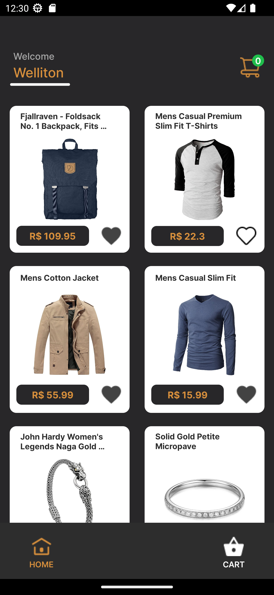
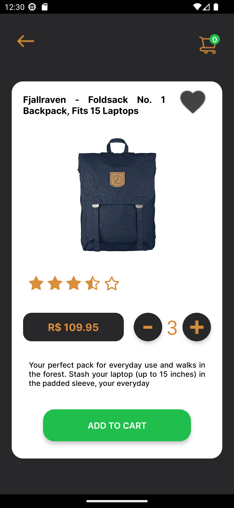
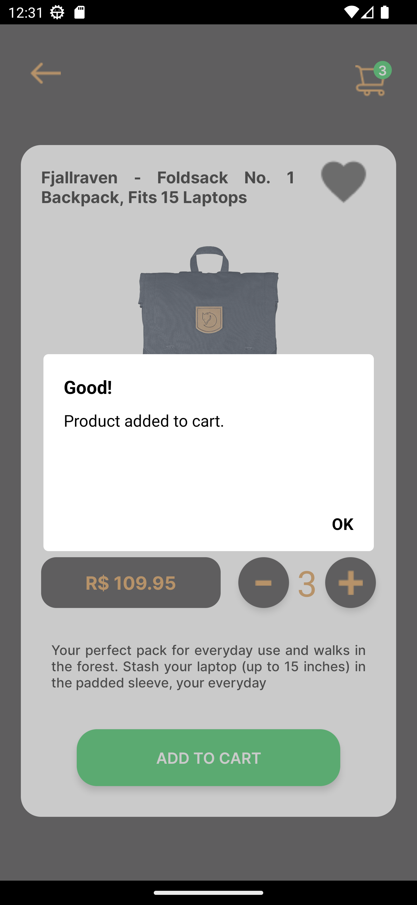
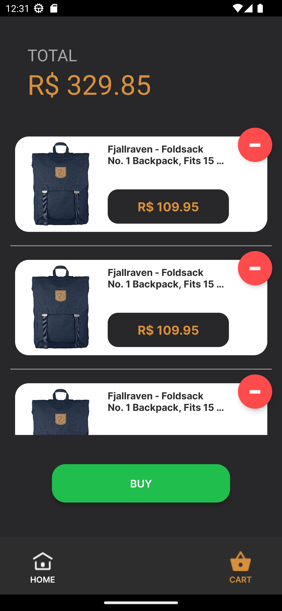
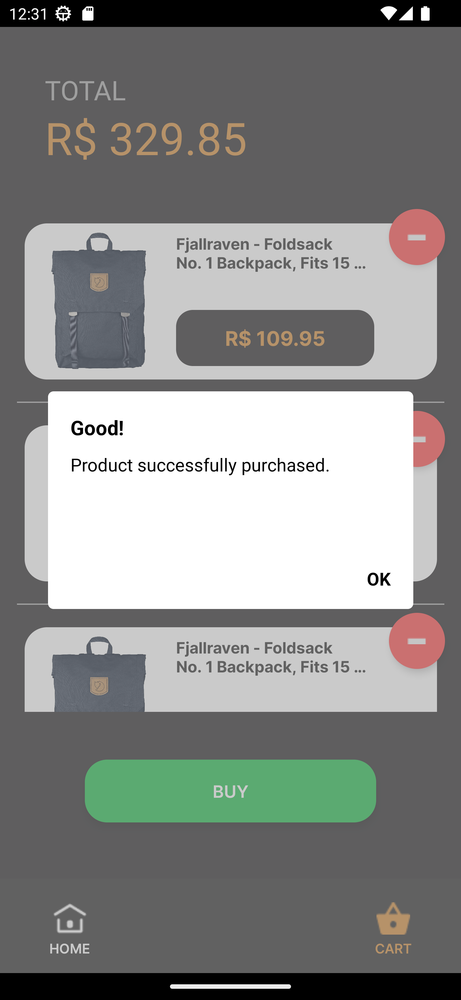
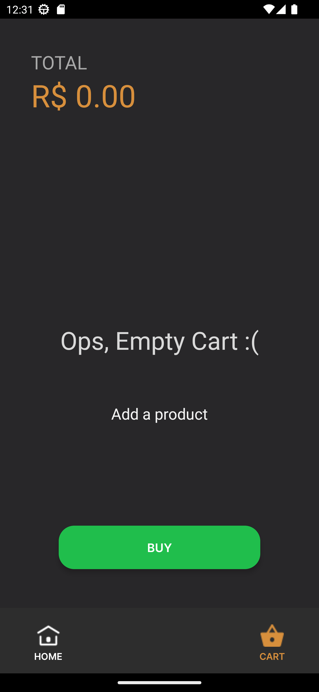

# Ecommerce Compass UOL

<h2> About </h2>
<h3> The objective of this project is to develop an e-commerce application in React Native, where the user must fill in all login fields before proceeding to the next screen. If the user doesn't fill in the fields correctly, error messages will be displayed. </h3>
<h3> Once the user successfully registers, they will be taken to the Home page, where some products will be displayed. Then, the user can select any product, choose its quantity, and add it to the shopping cart. Finally, within the shopping cart, the user can remove or purchase the product. </h3>
<h3> Another goal of this project is to create an intuitive and user-friendly application that ensures the user provides all the necessary information on the login page and that the application meets the main requirements listed by the UI/UX team. </h3>

## Installation

To run this app on your local machine, firt clone the repository:

```bash
  git clone https://github.com/PauloAbrahao/Login-Page-Compass.git
```

Then, navigate to the project directory and install the dependencies:

```bash
  cd Login-Page-Compass
```

```bash
  npm install
```

Finally, start the app:

```bash
  npm start
```

<h2 align="center"> Screens </h2>
<p align="center">
  
  
  
  
  
  
  
  
  
</p>

<h2 align="center"> Handle Errors </h2>
<p align="center">
  
  
</p>

<h2 align="center"> Success </h2>
<p align="center">
  
  
</p>

## 💻 Technologies used in this project:

- React Native
- Typescript
- Axios
- Context API
- Expo

## Authors

- [@Igormcgo](https://github.com/Igormcgo)
- [@PedroHVL14](https://github.com/PedroHVL14)
- [@DevRobh](https://github.com/DevRobh)
- [@PauloAbrahao](https://github.com/PauloAbrahao)
