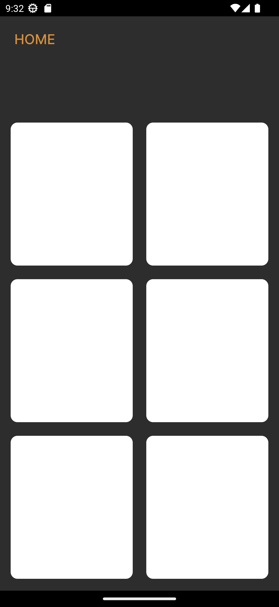
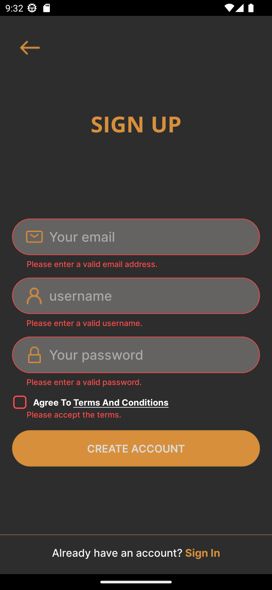

# Login-Page

- Compass UOL Challenge Week 8

<h1> ABOUT </h1>
<h3> The objective of this project is to develop a React Native application with three screens in which the user must fill in all fields before moving on to the next screen. In case the user doesn't fill the fields correctly, error messages will appear. The main goal is to create an intuitive and user-friendly app that ensures the user provides all the necessary information before proceeding to the next step. </h3>

<h1 align="center"> SCREENS </h1>

  
  
  

<h1 align="center"> HANDLE ERRORS </h1>

  
  

<h1 align="center"> SUCCESS </h1>

  
  

## 💻 Technologies used in this project:

- React Native
- Typescript
- Expo
